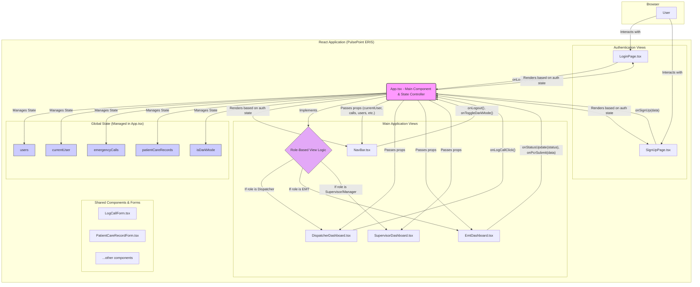

# PulsePoint ERIS - Technical Documentation

## Introduction

This document provides a detailed technical overview of the PulsePoint ERIS application. It is intended for software developers, system architects, and anyone else who needs to understand the internal workings of the application.

PulsePoint ERIS is a client-side Single-Page Application (SPA) built entirely with React and TypeScript. It simulates a real-world Emergency Response Information System and features a component-based architecture, centralized state management, and a responsive, themeable UI.

**Technology Stack:**
- **UI Framework:** React 19
- **Language:** TypeScript
- **Styling:** Tailwind CSS (via CDN)
- **Charts:** Chart.js (via CDN)

---

## 1. System Architecture

### High-Level Overview

The application is architected around a central root component, `App.tsx`, which acts as the orchestrator for state, routing, and authentication. All data is managed within this component and passed down to child components via props. This creates a unidirectional data flow, which makes the application predictable and easier to debug.

- **State Management:** All "global" application state (e.g., logged-in user, list of calls) resides in `App.tsx` and is managed with React's built-in `useState` and `useEffect` hooks.
- **Component-Based:** The UI is broken down into logical, reusable components, each with a specific responsibility.
- **Data Flow:** Data flows down from `App.tsx` to child components as props. State changes are initiated by child components calling callback functions (also passed as props) that are defined in `App.tsx`.

### Architecture Diagram

The following diagram illustrates the high-level architecture, component hierarchy, and data flow within the application.

---

## 2. State Management

### Strategy: Centralized State in Root Component

Given the application's scope, a dedicated state management library like Redux or MobX was deemed unnecessary. Instead, we use a simple and effective pattern where the root `App.tsx` component serves as the single source of truth.

### Global State Variables

The following key state variables are defined and managed in `App.tsx`:

-   `users`: `User[]` - The complete list of all registered users in the system.
-   `currentUser`: `User | null` - The user object for the currently logged-in user. If `null`, the user is logged out. This object drives all role-based access control.
-   `emergencyCalls`: `EmergencyCall[]` - An array of all emergency call objects logged in the system.
-   `patientCareRecords`: `PatientCareRecord[]` - A collection of all submitted PCRs.
-   `view`: `string` - Controls which sub-view is visible within a dashboard (e.g., switching from the dispatcher dashboard to the log call form).
-   `authView`: `string` - Toggles between the 'login' and 'signup' screens.
-   `isDarkMode`: `boolean` - Tracks the current UI theme.

### Data Flow Pattern: Props Down, Callbacks Up

-   **Props Down:** The `App` component passes the necessary state down to its children as props. For example, `DispatcherDashboard` receives the `calls` and `users` arrays to display them.
-   **Callbacks Up:** When a child component needs to mutate the global state, it invokes a callback function passed down from `App`. For example, when the `LoginPage` form is submitted, it calls the `onLogin` prop with the username and password. The `handleLogin` function inside `App` then executes the logic to update the `currentUser` state, triggering a re-render of the application.

This pattern keeps components decoupled from the state logic and makes the flow of data easy to trace.

---

## 3. Component Breakdown

The application's source code is organized into a `components` directory, with supporting files like `types.ts` and `constants.ts` at the root.

-   **`App.tsx`**: The orchestrator. Manages all state and renders other components based on the current user's role and authentication status.

-   **`types.ts`**: Contains all TypeScript interface and type definitions (e.g., `User`, `EmergencyCall`) used throughout the application.

-   **`constants.ts`**: Contains static data, primarily the initial seed array of `USERS`.

### `components/` Directory

-   **Authentication**
    -   `LoginPage.tsx`: Renders the login form. A controlled component that reports credentials to `App.tsx` via a callback.
    -   `SignUpPage.tsx`: Renders the registration form and handles basic validation.

-   **Core UI**
    -   `NavBar.tsx`: The persistent top navigation bar. Displays the logged-in user, a logout button, and the dark mode toggle.
    -   `ConfirmationPage.tsx`: A generic success page shown after actions like logging a new call.

-   **Role-Based Dashboards**
    -   `DispatcherDashboard.tsx`: A complex component featuring a multi-column layout. It displays the active call list and the real-time team availability panel. It contains its own local state for managing filters and search queries.
    -   `EmtDashboard.tsx`: The primary interface for EMTs. It shows assigned calls, allows for status updates, integrates a map view, and contains the logic to switch to the PCR form view.
    -   `SupervisorDashboard.tsx`: A read-only view focused on analytics. It displays KPI cards and a detailed incident log. Contains the logic for exporting all call data to CSV.

-   **Forms**
    -   `LogCallForm.tsx`: A controlled form for dispatchers to enter new incident details.
    -   `PatientCareRecordForm.tsx`: A controlled form for EMTs to document patient care post-incident.

-   **`icons/`**
    -   This subdirectory contains small, stateless React components for each SVG icon used in the UI, promoting reusability and a clean codebase.

---

## 4. Key Workflows

### User Authentication

1.  **Initial Load:** `currentUser` state in `App.tsx` is `null`. The app renders `<LoginPage />`.
2.  **Submission:** The user fills in their credentials and clicks "Sign In". The `handleLogin` form handler in `<LoginPage>` calls the `onLogin` prop function.
3.  **State Update:** The `handleLogin` function in `App.tsx` searches the `users` array. If a match is found, `setCurrentUser` is called with the user object.
4.  **Re-render:** The state change causes `App.tsx` to re-render. `currentUser` is no longer `null`, so the `renderDashboard()` logic is executed.
5.  **Dashboard Display:** Based on `currentUser.role`, the appropriate dashboard component is rendered.

### EMT Status Update & Real-Time Reflection

1.  **Action:** An EMT logged into `<EmtDashboard>` clicks the "En Route" button.
2.  **Callback:** The `onClick` handler calls the `onStatusUpdate('En Route')` prop function.
3.  **Global State Mutation:** The `handleEmtStatusUpdate` function in `App.tsx` receives the user's ID and the new status. It maps over the `users` array, finds the correct user, and returns a new array with that user's status updated. The state is updated via `setUsers`.
4.  **System-Wide Re-render:**
    -   `App.tsx` re-renders.
    -   `<EmtDashboard>` re-renders because its `currentUser` prop (which is also updated) has changed, showing the new status.
    -   `<DispatcherDashboard>` receives the new `users` array as a prop. Its `TeamAvailabilityPanel` re-renders, showing the EMT's updated status ("Dispatched") in real-time.

### Security & Compliance

-   **Role-Based Access Control (RBAC):** Access is controlled entirely within `App.tsx`'s `renderDashboard` function. The component rendered depends directly on the `role` property of the `currentUser` state object. This prevents a user from accessing a dashboard they are not authorized for.
-   **Data Handling:** In this prototype, all data is stored in-memory and is reset on page refresh. A production-ready version would require:
    -   A secure backend API with robust authentication and authorization.
    -   End-to-end encryption (HTTPS/TLS).
    -   A database with encryption at rest to comply with HIPAA regulations for handling Protected Health Information (PHI).
